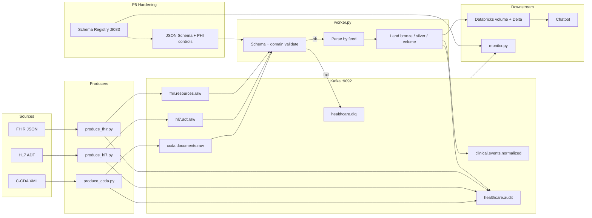

# Healthcare Event Pipeline — Kafka (Python)

Multi-format clinical event pipeline: **C-CDA**, **HL7 ADT**, and **FHIR** → Kafka → validate/parse → bronze/silver/volume landing → optional Databricks + chatbot.

**Contributor / commits:** [muhammadaziz-ui](https://github.com/muhammadaziz-ui)

---

## Architecture

Clinical files are wrapped in a common **event envelope**, published to Kafka **raw** topics, consumed by one multi-format **worker**, then landed locally (and optionally published to Databricks for the chatbot).



### Components

| Layer | What |
|--------|------|
| **Infra** | Docker: Kafka (`9092`), Kafka UI (`8088`), Schema Registry (`8083`) |
| **Ingest** | Producers build envelope → JSON Schema check → raw topic + audit |
| **Process** | Worker consumes all raw topics; routes by topic/feed → C-CDA / HL7 / FHIR parser |
| **Land** | Success → bronze / silver / volume; failure → DLQ + audit |
| **Normalize** | Emits `clinical.events.normalized` for downstream consumers |
| **Cloud (optional)** | `publish_to_databricks.py` → UC volume + Delta → chatbot refresh |
| **Hardening (P5)** | Schema Registry, local schemas, PHI log redaction, retention, `monitor.py` |

### Kafka topics

| Topic | Purpose |
|--------|---------|
| `ccda.documents.raw` | Inbound C-CDA documents |
| `hl7.adt.raw` | Inbound HL7 ADT messages |
| `fhir.resources.raw` | Inbound FHIR resources/bundles |
| `clinical.events.normalized` | Parsed clinical events |
| `healthcare.dlq` | Rejected / failed messages |
| `healthcare.audit` | Produce / normalize / DLQ audit trail |

### Landing zones

| Path | Role |
|------|------|
| `healthcare-pipeline/landing/bronze/` | Envelope metadata (payload often stripped) |
| `healthcare-pipeline/landing/silver/` | Patient summaries / section markdown |
| `healthcare-pipeline/landing/volume/` | Source artifact for volume-style publish |
| `healthcare-pipeline/landing/dlq/` | Local copy of failed events |
| `healthcare-pipeline/landing/metrics/` | Health snapshots from `monitor.py` |

---

## Flow

### Happy path

1. Clinical file in → producer builds **envelope** (`event_id`, hashed `patient_key`, payload, `phi_level`, `trace_id`)
2. JSON Schema validation → publish to matching **raw** topic + **audit**
3. Worker consumes raw → schema + domain validation → feed-specific parse (C-CDA / HL7 / FHIR)
4. Land **bronze** / **silver** / **volume**
5. Publish **normalized** clinical event + audit
6. Optional: push landings to Databricks volume/Delta → chatbot refresh

```text
Sources (C-CDA / HL7 / FHIR)
  → Producers (envelope + JSON Schema)
  → Kafka raw topics
  → Worker (validate → parse → land)
  → clinical.events.normalized + audit
  → optional Databricks volume/Delta → chatbot
```

### Failure path

Schema / validation / parse fail → **`healthcare.dlq`** + `landing/dlq/` + audit entry.  
`monitor.py` warns when DLQ files are present.

### Envelope (identity & PHI)

- `patient_key` is a **hash** (never MRN/name as the key)
- `ssn` / `social_security_number` fields are rejected by schema
- Logs redact display name / MRN / phone when `REDACT_PHI_IN_LOGS=1`
- Bronze may omit raw payload when `STRIP_PAYLOAD_FROM_BRONZE=1`

---

## Quick start

```bat
cd /d "<this-repo>"
docker compose -f docker-compose.yml -f docker-compose.p5.yml up -d

cd healthcare-pipeline
scripts\setup-p5.bat
scripts\worker.bat
```

| Service | URL |
|---------|-----|
| Kafka | `localhost:9092` |
| Schema Registry | http://localhost:8083 |
| Kafka UI | http://localhost:8088 |

See `healthcare-pipeline/README.md` and `healthcare-pipeline/docs/P5_HARDENING.md`.

## Phases

| Phase | Scope |
|-------|--------|
| P1 | C-CDA → Kafka → local landing |
| P2 | Databricks volume + Delta |
| P3 | Chatbot refresh / deploy |
| P4 | HL7 ADT + FHIR feeds |
| P5 | Schema Registry, PHI controls, monitor, retention |
