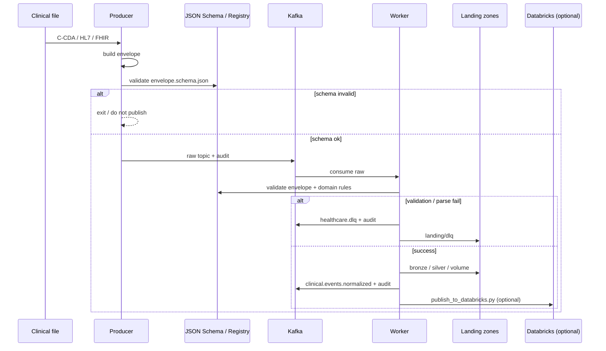

# Architecture & Flow

See the root [README.md](../README.md) for the full architecture diagram, topic map, landing zones, and happy/failure flow.

## Message path (detail)

## Feed routing

| Raw topic | Feed | Parser |
|-----------|------|--------|
| `ccda.documents.raw` | ccda | `pipeline/ccda_parser.py` |
| `hl7.adt.raw` | hl7 | `pipeline/hl7_parser.py` |
| `fhir.resources.raw` | fhir | `pipeline/fhir_parser.py` |
